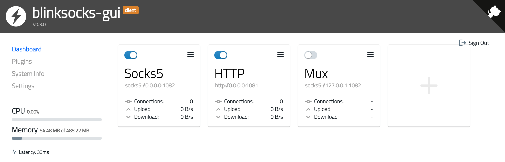
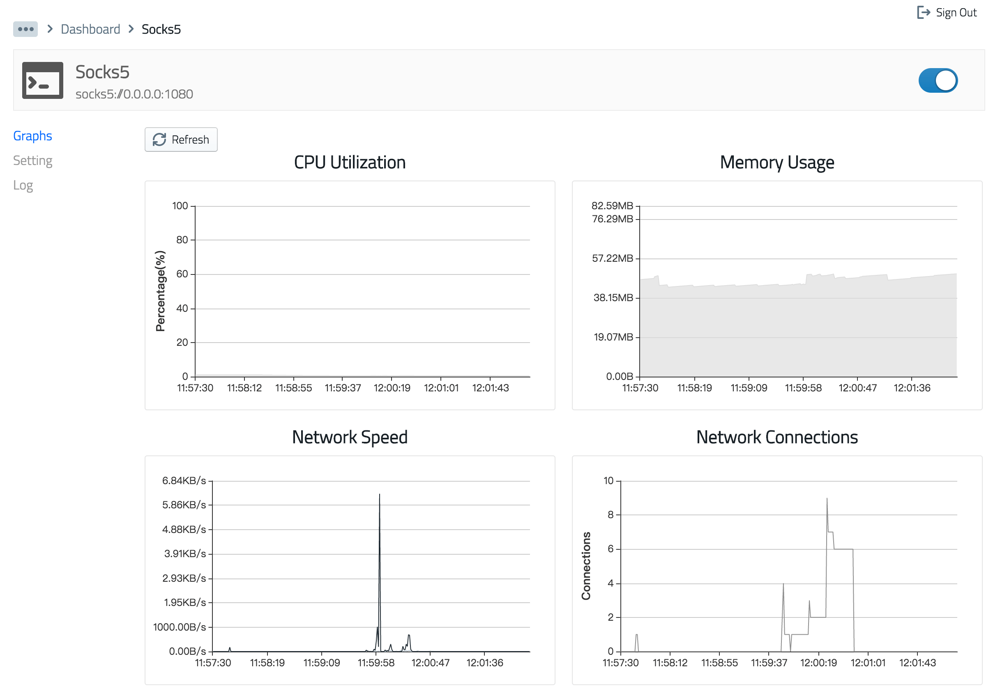

# blinksocks-gui

[](https://www.npmjs.com/package/blinksocks-gui)
[](https://www.npmjs.com/package/blinksocks-gui)
[](https://github.com/blinksocks/blinksocks-gui/blob/master/LICENSE)
[](https://www.npmjs.com/package/blinksocks-gui)
[](https://www.npmjs.com/package/blinksocks-gui)
[](https://github.com/blinksocks/blinksocks-gui)

为 [blinksocks](https://github.com/blinksocks/blinksocks) 封装的 WEB 图形化界面。





## 在线体验（只读模式）

https://gui.blinksocks.org/landing?password=preview

## 特性

- 三大平台支持（Windows、Linux、macOS）
- 双端图形化界面
- 单机服务多开
- 远程服务配置、启动/停止
- 实时监控图表（CPU、内存、上下行速度、网络连接数、网络流量）
- 日志查看和搜索

## 安装

### 使用 npm 安装或升级（推荐）

在此之前，请先安装 [Node.js](https://nodejs.org/en/)，Node.js 自带 npm 包管理器。

> Tips: 如果你是在服务端（一般是 Linux）上使用，可以使用官方提供的安装脚本：
> https://nodejs.org/en/download/package-manager/#installing-node-js-via-package-manager

然后执行下面的命令安装 blinksocks 和 blinksocks-gui：

```
$ npm install -g blinksocks blinksocks-gui
```

需要升级时重新执行上面的命令即可。

### 使用预编译版本

> 使用预编译版本无需安装 Node.js 和其他依赖软件，但升级时必须重新下载、解压和替换整个软件包。

下载地址：https://github.com/blinksocks/blinksocks-gui/releases

## 启动

### 交互式启动

桌面环境双击直接运行，服务器环境从命令行启动：

```
$ blinksocks-gui
```

根据提示选择启动类型（客户端或者服务端）：

```
? Please choose run type › - Use arrow-keys. Return to submit.
❯  Client
   Server
```

选择一个端口号用于远程访问图形界面：

```
✔ Please choose run type › Client
? Please choose a port(1 ~ 65535) for web ui: › 3000
```

完成后在**浏览器**中打开提示链接即可：

```
✔ Please choose run type › Client
✔ Please choose a port(1 ~ 65535) for web ui: … 3000
info: blinksocks gui client is running at 3000.
info: You can now open blinksocks-gui in browser:

  http://localhost:3000/

```

### 命令行启动

```
$ blinksocks-gui --client --port 3000
```

> Tips: 第一次启动时，程序会自动创建一个 `root` 用户，初始密码为 `root`，在 `/landing` 页面输入初始密码后登录系统。

## 修改初始登录密码

转到 `/settings` 页面或点击左侧 `Settings` 菜单进入系统配置面板修改相关配置并保存。

## 开发指引

### 拉取仓库并初始化

```
$ git clone https://github.com/blinksocks/blinksocks-gui
$ cd blinksocks-gui
$ git submodule update --init
```

### 安装依赖

**core 模块安装**

```
$ cd core
$ npm install
$ npm install --no-save blinksocks
```

**ui 模块安装**

```
$ cd ui
$ npm install
```

### 启动调试

启动本地 HTTP/WebSocket 服务：

```
$ cd core && npm run start:client
```

启动前端开发服务器：

```
$ cd ui && npm start
```

根据提示打开链接开始调试。

### 编译和打包

只需要编译打包前端代码，完成后会自动替换 `core/public` 里的内容：

```
$ cd ui && npm run build
```

### 发布

只需发布 `core/` 里的内容到 npm registry 即可：

```
$ cd core
$ npm publish
```

## 更新日志

[CHANGELOG.md](CHANGELOG.md)

## License

Apache License 2.0
